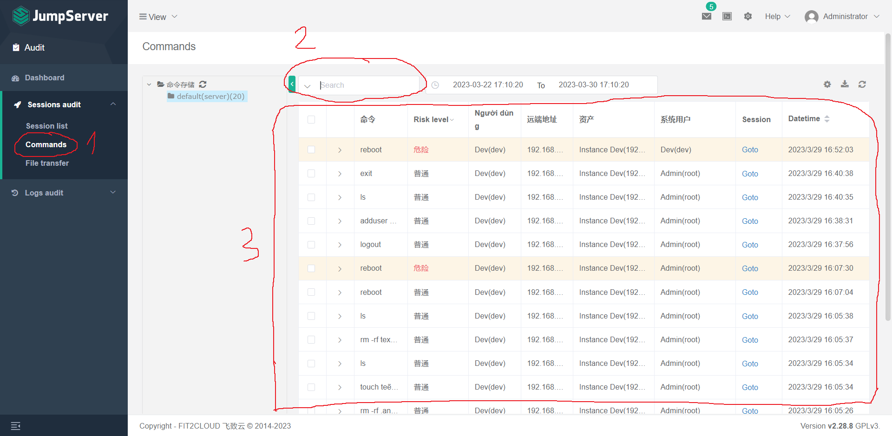

# Bastion Host - Jump Server v2
## Mục tiêu
1. Setup Jump Server trên instance Bastion Host
2. Setup xác thực MFA, user instance, assets instance, assets permissions, web terminal
3. Tạo user Jump Server, phân quyền truy cập (roles, user login instance,...)
4. Quản lý nâng cao (Command Filters, Sessions audit, Batch Command)

Chi tiết xem tại trang chủ: **[here](https://docs.jumpserver.org/zh/v2/)**
## Mô hình


### 1. Setup Jump Server và tạo SSH Key
- **Step 1**: Download Jump Server từ file nén
```console
sudo apt-get update
sudo apt-get install -y wget curl tar gettext iptables
cd /opt
wget https://github.com/jumpserver/installer/releases/download/v2.28.8/jumpserver-installer-v2.28.8.tar.gz
tar -xf jumpserver-installer-v2.28.8.tar.gz
cd jumpserver-installer-v2.28.8
```
- **Step 2**: Setup Jump Server
    
    Sửa đổi file config nếu cần thiết. Nếu không biết rõ mục đích, có thể bỏ qua!
    ```console
    cat config-example.txt
    ```
    Cài đặt và khởi động
    ```console
    ./jmsctl.sh install
    ./jmsctl.sh start
    ```
    Sau khi cài đặt xong, file config tại: /opt/jumpserver/config
    ```console
    config.txt  core  koko  mariadb  mysql  nginx  redis
    ```
    Các lệnh vận hành
    ```console
    cd /opt/jumpserver-installer-v2.28.8
    ./jmsctl.sh start
    ./jmsctl.sh down
    ./jmsctl.sh restart
    ./jmsctl.sh backup
    ./jmsctl.sh upgrade
    ./jmsctl.sh uninstall
    ./jmsctl.sh -h
    ```
- **Step 3**: Setup SSH Key
    
    Tạo SSH Key:
    ```console
    sudo ssh-keygen -t rsa
    ```
    Copy public key sang các instance cần ssh
    ```console
    ssh-copy-id user@IP
    ```

### 2. Setup truy cập căn bản
- **Step 1**: Bật xác thực MFA

    

    Logout ra và sử dụng phần mềm xác thực bảo mật 2 lớp (Google Authenticator, Authy, Duo Security, Azure Multi-Factor Authentication, Lastpass Authenticator,...)

- **Step 2**: Tạo user login vào các instance

    

    Nhập các thông tin cần thiết như:

    Basic: Tên, user login instance
    
    Authorization: Dùng password hoặc dùng SSH Key (trong hướng dẫn này sẽ sử dụng)
- **Step 3**: Create node, instance assets

    Tạo các node theo mục đích sử dụng (phòng ban, roles,...)
    
    
    
    Tạo các instance để truy cập và gán chúng vào các node tương ứng. Nhập các thông tin cần thiết như: "Basic, Auth, Node: Tên instance, IP,..."

    
    
- **Step 4**: Tạo các asset permissions để truy cập bằng web terminal

    Điền các thông tin cần thiết như: Basic, User, Asset (Tên permission, user Jump Server, node, user instance,...)

    

    Test truy cập bằng Web Terminal

    

    

### 3. Tạo user Jump Server và cấp quyền truy cập tương ứng
- **Step 1**: Tạo user SOC và gán role user

    

    

    Ảnh dưới là các quyền thao tác của **roles user**, các **roles mặc định không thể chỉnh sửa**. Nếu muốn tự custom roles bạn có thể tự tạo và tùy chỉnh theo mong muốn

    

- **Step 2**: Phân quyền truy cập cho user SOC (theo node instance, user login instance)

    

    Như vậy bạn có thể test truy cập bằng web terminal với **user Jump Server là soc** -> Chỉ được phép login vào **instance SOC** -> Với **user login instance là soc**

**=> Chú ý**: Hướng dẫn trên chỉ demo cách thức tạo user và phân quyền đơn giản:
- Có thể cho user truy cập thêm các node instance khác với các user login được chỉ định rõ ràng
- Cân nhắc nếu instance không có nhiều user thì có thể cấp phép cho login bằng user có sẵn
- Giới hạn các thao tác ngay trong phần tạo permission
- ...

### 4. Sử dụng Command Filters, Sessions audit, Batch Command

**Command Filters**

- Sử dụng để giới hạn quyền truy cập của người dùng vào các lệnh cụ thể trên các instance

- Điều này giúp ngăn chặn người dùng không có quyền truy cập vào các lệnh quan trọng, nhằm giảm thiểu các rủi ro bảo mật và đảm bảo tính an toàn cho hệ thống

VD: reboot, rm, systemctl enable, systemctl disable, ...


Sau khi tạo Command Filters, click vào tên Command Filters để tạo rules


Test reboot


**Sessions audit**

- Quản lý và giám sát truy cập, giúp quản trị viên ghi lại hoạt động của người dùng khi họ truy cập và thực hiện các hoạt động trên hệ thống. Sessions audit có thể được sử dụng để giám sát và phát hiện các hành vi đáng ngờ hoặc bất thường, cũng như giúp quản trị viên giải quyết các vấn đề bảo mật
- Trong **sessions audit** 2 tính năng thường được sử dụng là: **Session list** và **Commands**

    Session list

    

    Commands

    

**Batch Command**

- Cho phép người dùng thực hiện một chuỗi lệnh trên nhiều thiết bị mạng cùng một lúc

    

## Bài viết đến đây là hết! 

### Ngoài ra còn rất nhiều các tính năng hữu ích khác, các bạn có thể tự tìm hiểu và thực hành. Chúc các bạn thành công :3